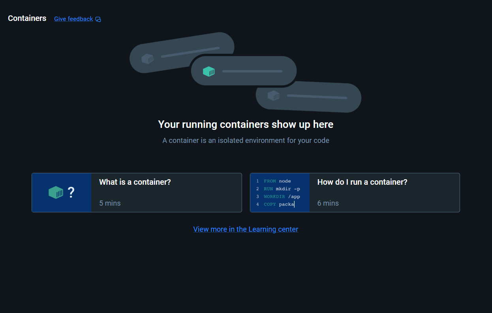
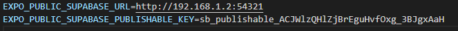
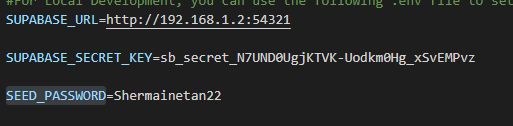

1. Must Install Docker Desktop
2. Must RUN Docker Desktop
3. Must see this screen on docker 

4. Install supabase CLI using  
   
   ```bash
   npm install -D supabase
   ```
5. Once installed, do
    ```bash
   npx supabase start
   ```
6. ASSUMING YOU ARE USING YOUR PHONE (EXPO GO)
   1. From the terminal, take the `Publishable Authentication Key` and the `Secret Authentication Key` <br><br>
   if not shown or terminal is cleared, do the command below 
        ```bash
            npx supabase status
        ```
   
   2. Go to terminal, do this command below, and take your pc IPv4 address <br>(Make sure phone is connected to same network as pc)
        ```bash
        ipconfig
        ```
   
   4. Go to `.env` in both the `root folder (the SC2006 folder)` and `apps\mobile folder`
   
   5. For `SC2006/.env`, fill in the 
      1. `SUPABASE_URL` with `http://YOURPCIPADDRESS:54321`
      2. `SUPABASE_SECRET_KEY` with `Secret Authentication Key` 
      3. `SEED_PASSWORD` with whatever u want, this is the password used for all test accounts
      4. Once done, save and run this command on terminal
            ```bash
            npm run seed
            ```
      6. This is to populate your database with the test data in `seed.mjs` into your local supabase
   
   
   6. For `SC2006/apps/mobile/.env`, fill in the
      1. `EXPO_PUBLIC_SUPABASE_URL` with `http://YOURPCIPADDRESS:54321`
      2. `EXPO_PUBLIC_SUPABASE_PUBLISHABLE_KEY` with `Public Authentication Key`
      3. This is for allowing the frontend to access the database
   <br><br>

   7. Example of what your `.env` files will look like
   
   <br>
   
7. # Very Important
   1. If your PC IPv4 address changes, you need to update the URL in the `.env` files, if not your phone cannot access the database
   2. When done, do the command below to stop supabase from running
        ```bash
        npx supabase stop
        ```